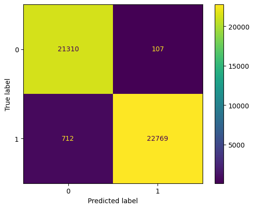
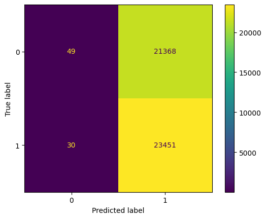

# Fake News Detector

Fake News Detector helps you determine whether the article is true or you are being lied to

## Installation
Fake News Detector requires [Python 3.11](https://www.python.org/downloads/release/python-3113/) to run

Clone this repository
```
git clone https://github.com/andrii-shchur/fake_news_detector.git
```

Install `pipenv`
```
pip install pipenv
```

Install dependencies from `Pipfile`
```
pipenv install
```

# Run application
Switch to `pipenv` shell
```
pipenv shell
```

Run the server
```
uvicorn main:app
```

Great! Now backend server is running on `http://localhost:8000`

Let's debunk fake news using GUI! Open `index.html` using your favorite web-browser, and you're good to go💪

# Other
We faced some struggles with using loaded model in our web application. Model trained in runtime demonstrated great 
performance, but when we tried to save the model and load it in our web application, it showed terrible results.

Here are confusion matrices that demonstrate performance of two models:

<details open>
  <summary>Model trained in runtime</summary>
    <ol>
    
    </ol>
</details>
<details open>
  <summary>Loaded model</summary>
    <ol>
    
    </ol>
</details>

**All attempts to load models are provided in [this file](attempts/attempts.py).**